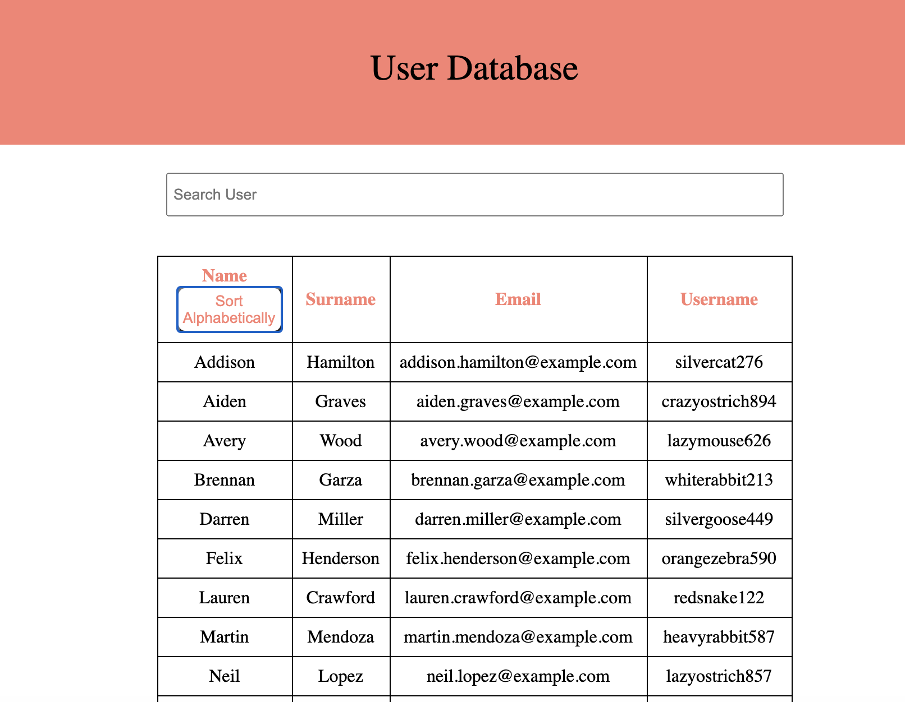

# User Directory



          
          
## Table of Contents
  - [User-Story](#User-Story)
  - [Installation](#Installation)
  - [Test](#Tests)
  - [Contributors](#Contributors)
  - [Licence](#Licence)
  - [GitHub](#GitHub)
          
## User-Story
As a user, I want to view my whole user directory. I want to be able to filter by at least one property and sort by at least one category. 

This table can be sorted by any column: name, surname, email, or username. It is also alphabetically sortable by name by clicking the sort button. 

View it here https://mighty-bayou-64854.herokuapp.com/

### Installation Instructions
To install the application run the following command:
```npm install```

### Tests
To test the application, run the following command:
```npm run test```

### Contributors
Thank you to Carl Kassebaum for being a massive help and suppot with this application, assisting me with understanding the concepts and how to tie it all together. 

Contributions are welcome. 

### Licence
MIT License

Copyright (c) 2020 Monique Loibner

Permission is hereby granted, free of charge, to any person obtaining a copy
of this software and associated documentation files (the "Software"), to deal
in the Software without restriction, including without limitation the rights
to use, copy, modify, merge, publish, distribute, sublicense, and/or sell
copies of the Software, and to permit persons to whom the Software is
furnished to do so, subject to the following conditions:

The above copyright notice and this permission notice shall be included in all
copies or substantial portions of the Software.

THE SOFTWARE IS PROVIDED "AS IS", WITHOUT WARRANTY OF ANY KIND, EXPRESS OR
IMPLIED, INCLUDING BUT NOT LIMITED TO THE WARRANTIES OF MERCHANTABILITY,
FITNESS FOR A PARTICULAR PURPOSE AND NONINFRINGEMENT. IN NO EVENT SHALL THE
AUTHORS OR COPYRIGHT HOLDERS BE LIABLE FOR ANY CLAIM, DAMAGES OR OTHER
LIABILITY, WHETHER IN AN ACTION OF CONTRACT, TORT OR OTHERWISE, ARISING FROM,
OUT OF OR IN CONNECTION WITH THE SOFTWARE OR THE USE OR OTHER DEALINGS IN THE
SOFTWARE.

### Github
- [GitHub](m.loibner@hotmail.com)

